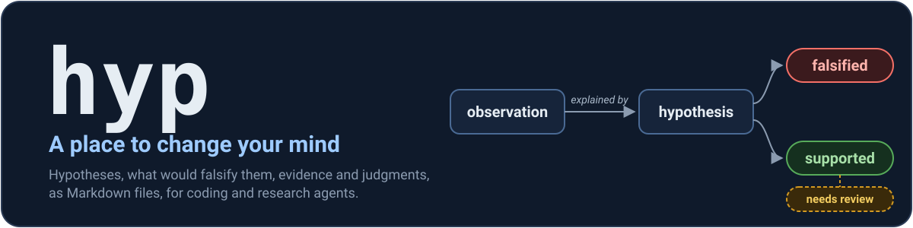
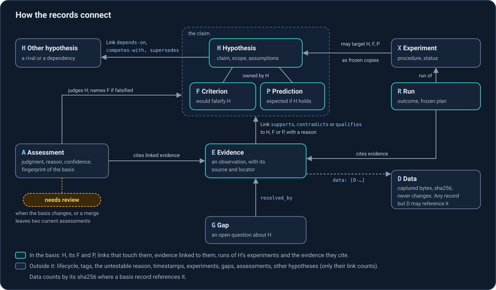
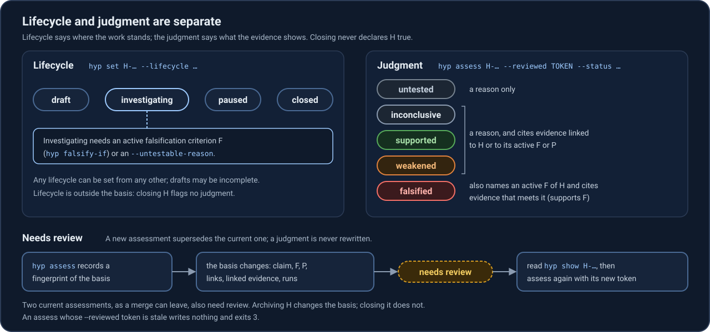
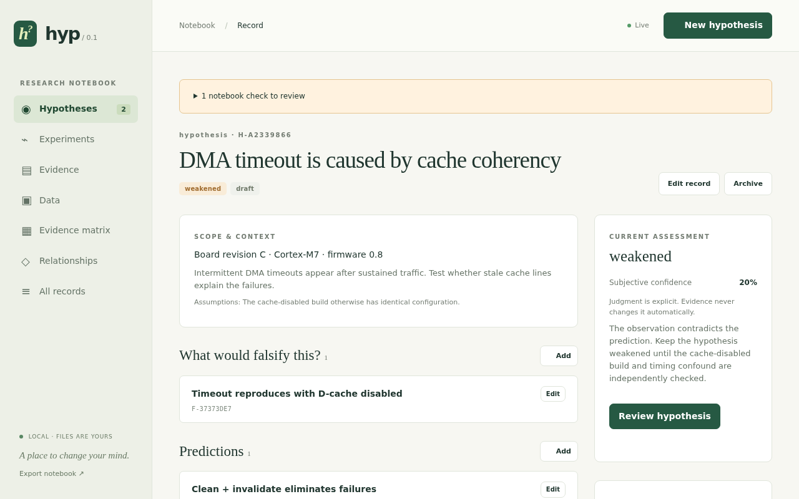

<p align="center"></p>

[](https://github.com/eisbaw/hyp/actions/workflows/ci.yml) [](LICENSE) [](Cargo.toml) [](flake.nix) [](#for-agents)

**hyp is [backlog.md](https://github.com/MrLesk/Backlog.md), but for hypotheses.** Coding and research agents record what they suspect, what would prove it wrong, what they observed and what they concluded. Humans inspect and steer through a live WebUI.

Agents readily report "the bug is probably X" as the root cause with nothing to back it. hyp turns the discipline into rules the tool enforces, because agents follow tool errors more reliably than advice in a prompt:

- An investigation needs a falsification criterion, or a stated reason why there can be none.
- Every judgment needs a rationale, and every one except `untested` cites linked evidence.
- `falsified` names a criterion and cites evidence that meets it.

One executable, WebUI included. Records are Markdown files in any directory. No account, cloud service, database server or telemetry.



## Quick start

From a clone of this repository:

```bash
nix run . -- --project /tmp/hyp-demo init --demo   # a synthetic example notebook
nix run . -- --project /tmp/hyp-demo web           # then open http://127.0.0.1:7432
```

Put `hyp` on your PATH with `nix profile install .` or `cargo install --path . --locked`.

## A first investigation

In an empty directory, after `hyp init`. Real output, trimmed at "…"; any unambiguous ID prefix works.

```console
$ hyp observe "Login test fails 23/200 on CI" --source "CI job 4402"
E-dfe7c6e6-…
$ hyp add "A shared temp dir causes it" --explains E-dfe7c6e6
H-f2ccc798-…
L-1526caae-…
$ hyp falsify-if H-f2ccc798 "Fails as often with a private temp dir per test"
F-42b18711-…
$ hyp evidence add F-42b18711 "Fails 22/200 with a private TMPDIR" --source "CI job 4410" \
    --reason "Same rate with an unshared temp dir"
E-f5e74db8-…
L-b9085f2c-…
$ hyp show H-f2ccc798
H-f2ccc798-…  hypothesis  review 3d71c48961db
…
Evidence
  against H
    E-f5e74db8-…  Fails 22/200 with a private TMPDIR
      source: CI job 4410 · observed 2026-10-01T20:03:56Z
      meets criterion F-42b18711 (counts against H) · link L-b9085f2c-…
…
$ hyp assess H-f2ccc798 --reviewed 3d71c48961db --status falsified --criterion F-42b18711 \
    --evidence E-f5e74db8 --reason "Rate unchanged with a private temp dir"
A-79434773-…
$ hyp status
1 open hypothesis · 2 unexplained observations · writes not blocked
H-f2ccc798  falsified · draft  A shared temp dir causes it
  criteria 1 · linked evidence 2 · open gaps 0 · experiments without runs 0
unexplained observations (no live hypothesis accounts for them; hyp add "…" --explains E-…, or hyp link E-… H-…):
  E-dfe7c6e6  Login test fails 23/200 on CI
  E-f5e74db8  Fails 22/200 with a private TMPDIR
```

`--reviewed` takes the token from line 1 of `hyp show`. If the basis or the current assessment changed since, `assess` writes nothing and exits `3`. The observation is unexplained again, ready for the next hypothesis; the lifecycle stays `draft` until you set it. More in [docs/usage.md](docs/usage.md).



## WebUI

`hyp web` serves it on 127.0.0.1 only ([details](docs/webui.md)). The demo notebook:



- Hypothesis pages: criteria, predictions, evidence by what it means for the hypothesis, experiments, runs, assessment history.
- Evidence matrix: every observation against every rival hypothesis.
- Live: CLI and editor saves update open tabs.
- A save that conflicts with a newer change is rejected, and the draft is kept.

## For agents

```bash
hyp init --agents claude,codex   # new project: also install the skill
hyp agents install               # existing project
```

The skill teaches the method: record the hypothesis before acting on it, write the falsification criterion first, cite evidence, assess only with evidence and a reason. The CLI is a [stable contract](docs/agents-contract.md) ([decision-0002](backlog/decisions/decision-0002%20-%20hyp-is-primarily-a-tool-for-agents-to-work-in-a-structured-way-with-tentative-unconfirmed-information-humans-inspect-and-steer.md)):

- `--json` for machine-readable output; write commands print the full ID of each record their changes named.
- Exit codes: `0` success, `1` error, `2` invalid arguments, `3` conflict (re-read, review, retry).
- Errors carry a stable `kind`: `conflict`, `invalid_input`, `not_found`, `blocked` and a few more.

## Git-friendly, Git-optional

hyp never runs `git` and needs no repository ([decision-0001](backlog/decisions/decision-0001%20-%20hyp-does-not-require-or-depend-on-Git-but-is-Git-friendly.md)). Inside one ([details](docs/storage.md)):

- One file per record, named by a UUID: branches and machines do not collide.
- Deterministic serialization: diffs show real changes.
- No generated index or cache under `hyp/`; `.hyp/` (locks) ignores itself.
- After a merge, `hyp check` lists repairs and `hyp list --needs-review` lists judgments to revisit.

## When not to use hyp

hyp records an investigation; it does not carry one out. It is the wrong tool for statistical analysis, automated hypothesis testing, literature search, argument mapping, a shared knowledge base or agent memory, a one-off evidence map, and plans and tasks. See [docs/model.md](docs/model.md#when-not-to-use-hyp).

## Documentation

- [Usage](docs/usage.md): install, the commands, evidence and links, observations, data records, batches.
- [Agents](docs/agents-contract.md): the skill, `--json`, exit codes, error kinds, preconditions.
- [Model](docs/model.md): records, rules, the review fingerprint, direction of fit, scope.
- [Storage](docs/storage.md): files, schema versions, checks and repairs, locking, Git, exports.
- [WebUI](docs/webui.md) and [Development](docs/development.md).
- [Validation](VALIDATION.md): what was checked, and at which commit.

## Related tools

backlog.md lent hyp its shape; Heuer's Analysis of Competing Hypotheses its evidence matrix. Doubt, POPPER, Argdown and others are compared in [docs/related-tools.md](docs/related-tools.md).

## License

MIT, see [LICENSE](LICENSE).
